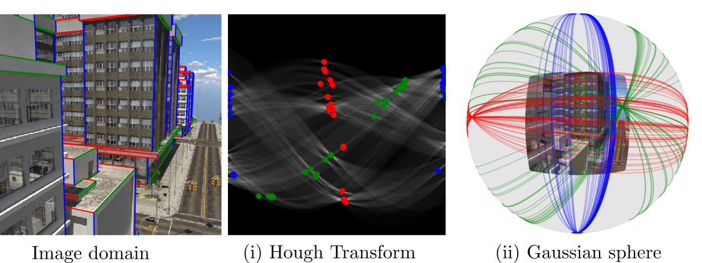
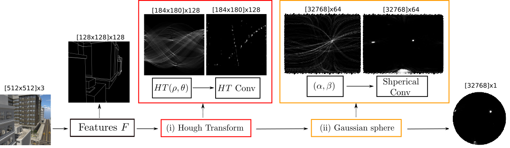
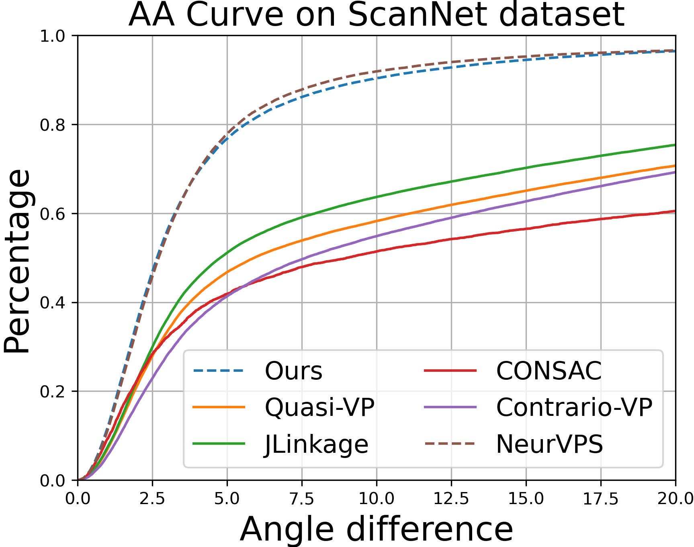
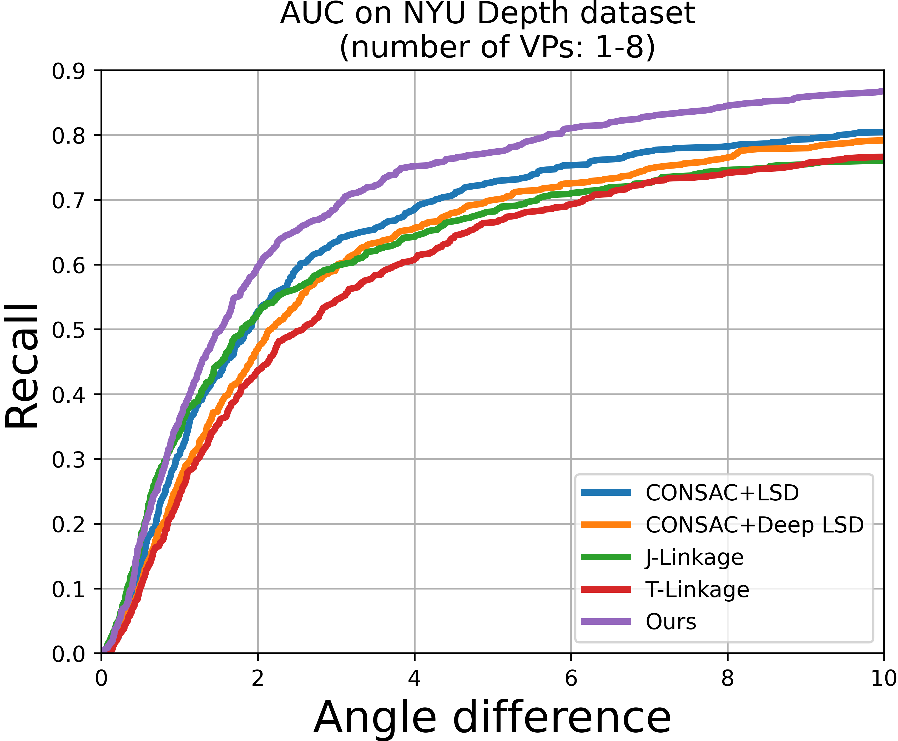
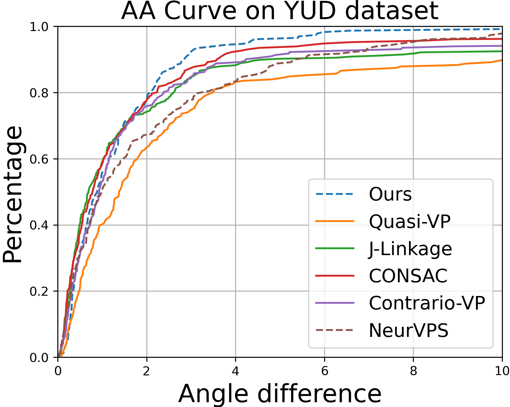
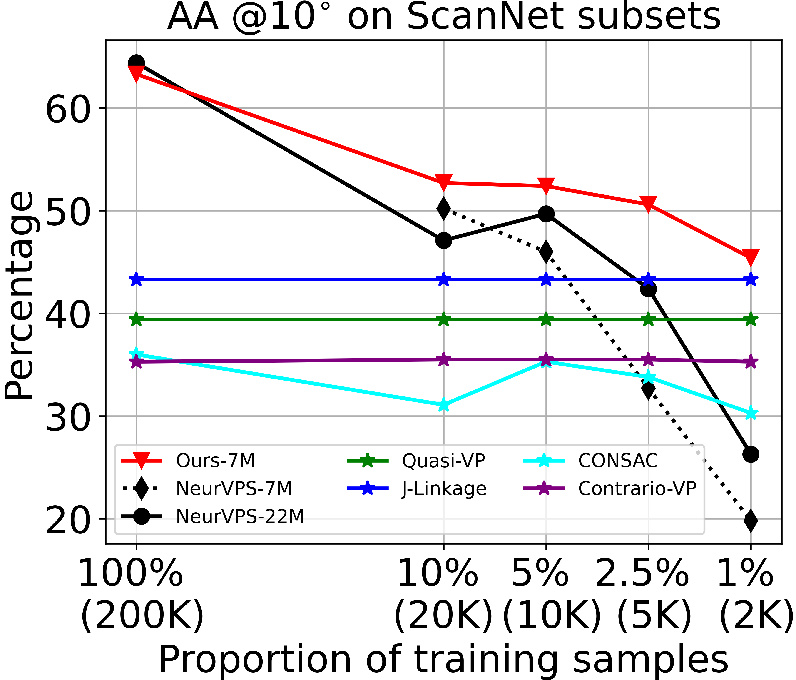
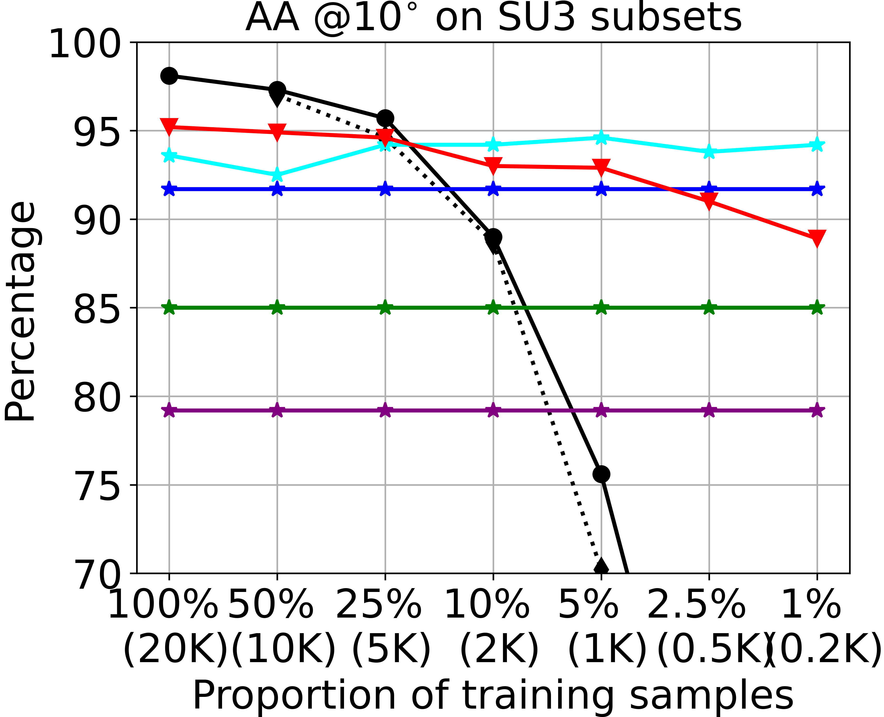

# Geometric priors make dataset variations vanish

Official implementation: [Deep vanishing point detection: Geometric priors make dataset variations vanish](), CVPR'22 

(Final check ongoing... camera-ready not yet available at this moment. You can reproduce the paper according to the code :))


[Yancong Lin](https://yanconglin.github.io/), [Ruben Wiersma](https://rubenwiersma.nl/), [Silvia Laura Pintea](https://silvialaurapintea.github.io/), [Klaus Hildebrandt](https://graphics.tudelft.nl/~klaus/), [Elmar Eisemann](https://graphics.tudelft.nl/~eisemann/) and [Jan C. van Gemert](http://jvgemert.github.io/)

E-mail: y.lin-1ATtudelftDOTnl; r.t.wiersmaATtudelftDOTnl

Joint work from [Computer Vision Lab](https://www.tudelft.nl/ewi/over-de-faculteit/afdelingen/intelligent-systems/pattern-recognition-bioinformatics/computer-vision-lab/) and [Computer Graphics and Visualization](https://graphics.tudelft.nl/) <br/> Delft University of Technology, the Netherlands

 


## Introduction
Deep learning has greatly improved vanishing point detection in images. Yet, deep networks require expensive annotated datasets trained on costly hardware and do not generalize to even slightly different domains and minor problem variants. Here, we address these issues by injecting deep vanishing point detection networks with prior knowledge. This prior knowledge no longer needs to be learned from data, saving valuable annotation efforts and compute, unlocking realistic few-sample scenarios, and reducing the impact of domain changes. Moreover, because priors are interpretable, it is easier to adapt deep networks to minor problem variations such as switching between Manhattan and non-Manhattan worlds. We incorporate two end-to-end trainable geometric priors: (i) <strong>Hough Transform</strong> -- mapping image pixels to straight lines, and (ii) <strong>Gaussian sphere</strong> -- mapping lines to great circles whose intersections denote vanishing points. Experimentally, we ablate our choices and show comparable accuracy as existing models in the large-data setting. We then validate that our model improves data efficiency, is robust to domain changes, and can easily be adapted to a non-Manhattan setting.


 ## Main Feature: Images - Hough Transform - Gaussian Sphere
  
 An overview of our model for vanishing point detection, with two geometric priors.
 
 
## Main Result: Manhanttan / non-Manhattan / domain-shift
        
 
 (i) Competitive results on large-scale Manhattan datasets: SU3/ScanNet;
 
 (ii) <strong>Advantage in detecting a varying number of VPs in non-Manhattan world: NYU Depth</strong>;
 
 (iii) <strong>Excellent performance on new datasets, e.g. train on SU3 (synthetic)/ test on YUD (real-world)</strong>.
 
 
## Data-Efficiency: superiority in small-data regime.
      
 

## Reproducing Results
We made minor changes on top of [NeurVPS](https://github.com/zhou13/neurvps) to fit our design. Many thanks to Yichao Zhou for releasing the code!

### Installation
For the ease of reproducibility, you are suggested to install [miniconda](https://docs.conda.io/en/latest/miniconda.html) (or [anaconda](https://www.anaconda.com/distribution/) if you prefer) before executing the following commands. Our code has been tested with miniconda/3.9, CUDA/10.2 and devtoolset/6.

```bash
conda create -y -n vpd
conda activate vpd
conda env update --file environment.yml
```


### (step 1) Processing the Dataset

SU3/ScanNet: we follow [NeurVPS](https://github.com/zhou13/neurvps) to process the data. 
```bash
cd data
../misc/gdrive-download.sh 1yRwLv28ozRvjsf9wGwAqzya1xFZ5wYET su3.tar.xz
../misc/gdrive-download.sh 1y_O9PxZhJ_Ml297FgoWMBLvjC1BvTs9A scannet.tar.xz
tar xf su3.tar.xz
tar xf tmm17.tar.xz
tar xf scannet.tar.xz
rm *.tar.xz
cd ..
```

NYU/YUD: we download the data from [CONSAC](https://github.com/fkluger/nyu_vp); and then process the data. 
```bash
python dataset/nyu_process.py --data_dir path/to/data --save_dir path/to/processed_data --mat_file path/to/nyu_depth_v2_labeled.mat
python dataset/yud_process.py --data_dir path/to/data --save_dir path/to/processed_data
```


### (step 2) Compute parameterizations: Hough Transform and Gaussian Sphere 
Compute the mapping from pixels -HT bins - Spherical points.
We use GPUs (Pytorch) to speed up the calculation. 
```bash
 python parameterization.py --save_dir='parameterization/nyu/' --focal_length=1.0 --rows=240 --cols=320 --num_samples=1024 --num_points=32768 # NYU as an example
```
You can also download our pre-calculated parameterizations from [SURFdrive](https://surfdrive.surf.nl/files/index.php/s/nKOCFAgZxulxHH0).

### (step 3) Train
We conducted all experiments on either GTX 1080Ti or RTX 2080Ti GPUs. 
To train the neural network on GPU 0 (specified by `-d 0`) with the default parameters, execute
```bash
python train.py -d 0 --identifier baseline config/nyu.yaml
```


### (step 4) Test
Manhattan world (3-orthogonal VPs):
```bash
python eval_manhattan.py -d 0  -o path/to/resut.npz  path/to/config.yaml  path/to/checkpoint.pth.tar
```

Non-Manhattan world (unknown number of VPs, one extra step - use DBSCAN to cluster VPs on the hemisphere):
```bash
python eval_nyu.py -d 0  --dump path/to/result_folder  config/nyu.yaml  path/to/nyu/checkpoint.pth.tar
python cluster_nyu.py --datadir path/to/nyu/data --pred_dir path/to/result_folder 
```

You can also download our checkpoints/results/logs from [SURFdrive](https://surfdrive.surf.nl/files/index.php/s/nKOCFAgZxulxHH0).


### ToDo: VP detection for Your Own Images


## Questions:
### (1) Where to find the source code for the Multi-scale version?
The Multi-scale version will be released later.

### (2) Details about focal length.
The focal length in our code is in the unit of 2/max(h, w) pixel (where h, w are the image height/width). Knowing the focal length is a strongh prior as one can utilize the Manhattan assumption to find orthogonal VPs in the camera space. 

### (3) Focal length unknown/uncalibrated images.
In this case, you can set the focal length to 1.0 as in [config/nyu.yaml](https://github.com/yanconglin/VanishingPoint_HoughTransform_GaussianSphere/blob/2609bfe4d8f4beefe7e75be0a5f25b5458ed83f2/config/nyu.yaml). You might need to think about how to find VPs without the Manhattan assumption. One solition is clustering as shown on the NYU dataset. A second solution could be simply picking up the top-k VPs (similar to [topk_orthogonal_vps](https://github.com/yanconglin/VanishingPoint_HoughTransform_GaussianSphere/blob/2609bfe4d8f4beefe7e75be0a5f25b5458ed83f2/eval_manhattan.py#L49), where you can choose the top-k VPs that are equally spread over the hemisphere). There are other solutions as well. Unfortunately, without more knowledge, I can not tell you which solution is a better one.

### (4) HT/Gaussian sphere quantization.
Quantization details in this repo (Pixels - HT -Gaussian Sphere) are:<br/>
SU3:     256x256 - 365x180 - 32768; (precise VPs)<br/>
ScanNet: 256x256 - 365x180 - 16384; (coarse VPs only)<br/>
NYU/YUD: 240x320 - 403x180 - 32768;<br/>

But, do we actually need this fine-grained sampling? I have also tested a less-fine-grained sampling (e.g. 128x128 - 184x180 - 32768/16384), and only observed marginal decrease. My understanding is that sampling at (128x128 - 184x180 - 16384) is already good enough for a decent result. Moreover the training/inderence speed almost doubles. However, to compete on large benchmarks, it might be necessary to use the finest. You can also find quantitive results in Tab 2, where we do sampling at (128x128 - 184x180 - 32768/16384) level for the multi-scale version. Overall, quantization has always been a big minus for the classic HT/Gaussian sphere, despite of their excelllence in adding inductive knowledge.


### Citation
If you find our paper useful in your research, please consider citing:
```bash
@article{lin2022vpd,
  title={Deep vanishing point detection: Geometric priors make dataset variations vanish},
  author={Lin, Yancong and Wiersma, Ruben and and Pintea, Silvia L and Hildebrandt, Klaus and Eisemann, Elmar and van Gemert, Jan C},
  booktitle={Conference on Computer Vision and Pattern Recognition},
  year={2022}
}
```

