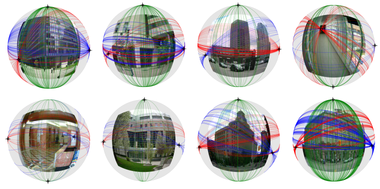

# Geometric priors make dataset variations vanish
Working on the repo now. May take several days to finalize...

Official implementation: [Deep vanishing point detection: Geometric priors make dataset variations vanish](), CVPR'22 

[Yancong Lin](https://yanconglin.github.io/), [Ruben Wiersma](https://rubenwiersma.nl/), [Silvia Laura Pintea](https://silvialaurapintea.github.io/), [Klaus Hildebrandt](https://graphics.tudelft.nl/~klaus/), [Elmar Eisemann](https://graphics.tudelft.nl/~eisemann/) and [Jan C. van Gemert](http://jvgemert.github.io/)

E-mail: y.lin-1ATtudelftDOTnl; r.t.wiersmaATtudelftDOTnl

Joint work from [Computer Vision Lab](https://www.tudelft.nl/ewi/over-de-faculteit/afdelingen/intelligent-systems/pattern-recognition-bioinformatics/computer-vision-lab/) and [Computer Graphics and Visualization](https://graphics.tudelft.nl/) <br/> Delft University of Technology, the Netherlands

 

## Introduction

Deep learning has greatly improved vanishing point detection in images. Yet, deep networks require expensive annotated datasets trained on costly hardware and do not generalize to even slightly different domains and minor problem variants. Here, we address these issues by injecting deep vanishing point detection networks with prior knowledge. This prior knowledge no longer needs to be learned from data, saving valuable annotation efforts and compute, unlocking realistic few-sample scenarios, and reducing the impact of domain changes. Moreover, because priors are interpretable, it is easier to adapt deep networks to minor problem variations such as switching between Manhattan and non-Manhattan worlds. We incorporate two end-to-end trainable geometric priors: (i) <strong>Hough Transform</strong> -- mapping image pixels to straight lines, and (ii) <strong>Gaussian sphere</strong> -- mapping lines to great circles whose intersections denote vanishing points. Experimentally, we ablate our choices and show comparable accuracy as existing models in the large-data setting. We then validate that our model improves data efficiency, is robust to domain changes, and can easily be adapted to a non-Manhattan setting.


 ## Main Feature: Images - Hough Transform - Gaussian Sphere
    
 
 An overview of our model for vanishing point detection, with two geometric priors.
 
 
## Main Results: Manhanttan (ScanNet) / non-Manhattan (NYU) / cross-dataset (YUD)

        
 
 (i) Competitive results on large-scale Manhattan datasets: SU3/ScanNet;
 
 (ii) <strong>Advantage in detecting a varying number of VPs in non-Manhattan world</strong>;
 
 (iii) <strong>Excellent performance on new datasets (e.g. train on SU3 (synthetic)/ test on YUD (small-scale, real-world))</strong>.
 
 
 ## Data-Efficiency: superiority over SOTA in SMALL-DATA regime.

      
 

## Reproducing Results

We made minor changes on top of [NeurVPS](https://github.com/zhou13/neurvps) to fit our design.  (Thanks Yichao Zhou for such a nice implementation!)

### Installation

For the ease of reproducibility, you are suggested to install [miniconda](https://docs.conda.io/en/latest/miniconda.html) (or [anaconda](https://www.anaconda.com/distribution/) if you prefer) before executing the following commands. 

```bash
conda create -y -n vpd
source activate vpd
conda env update --file environment.yml
  
